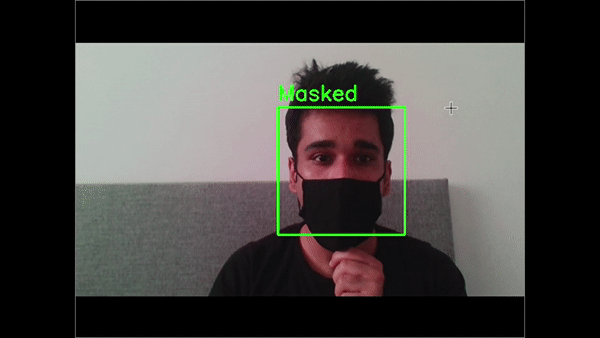

# mask_detection_COVID19
 Facial mask detection using openCV and TensorFlow2.0
 
 Mask Detector built using openCV and TensorFlow. Credits:  kaggle.com/dohunkim
 
 Model trained with 600+ images to achieve higher accuracy.
 

